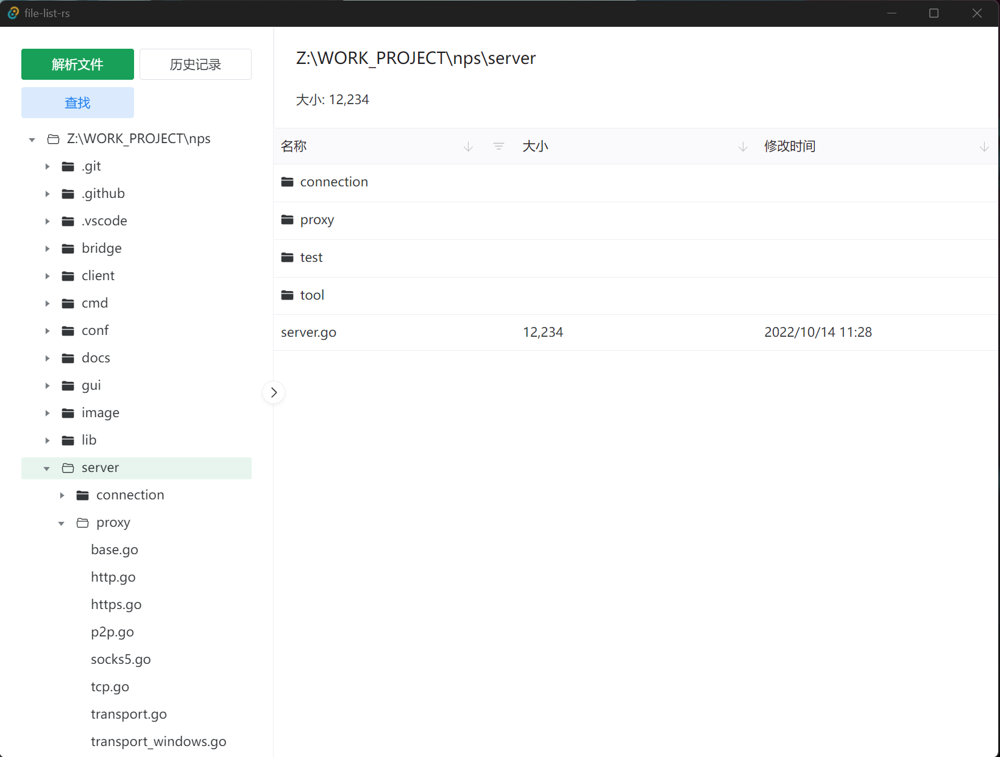

# File-List-rs

将命令输出的内容可视化的文件浏览器. 基于Tauri开发，前端使用Webview, 后端使用Rust.




采用Sled解析 (在sled中执行解析，图形压力较小，根据文件大小会消耗对应的硬盘空间，大概是文件的10倍左右，注意硬盘空间)
解析速度由你的IO速度决定.

## Futures

- [x] `dir /s *.*`
- [ ] `ls -alhR`
- [x] 英文
- [x] 中文

## build

- node 16.18.0
- rustc 1.68.1

```
sudo apt-get install libssl-dev # linux
pnpm tauri build
```

构建物在`src-tauri/target/release`目录下，
安装包在`src-tauri/target/release/bundle`目录下。

> tauri 无法交叉编译，每次需要在对应的平台上编译.

## Bechmark

- 70MB 解析需要 40秒 (disk: 200MB/s)
